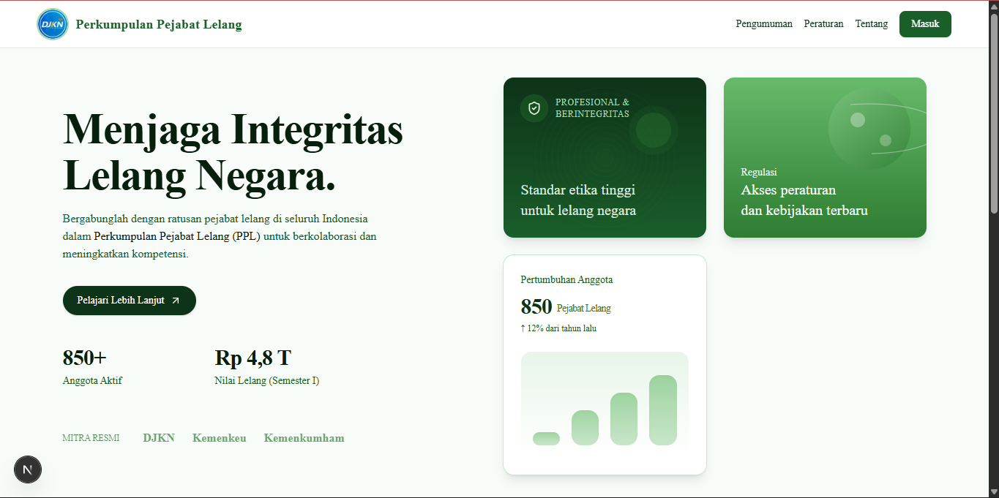
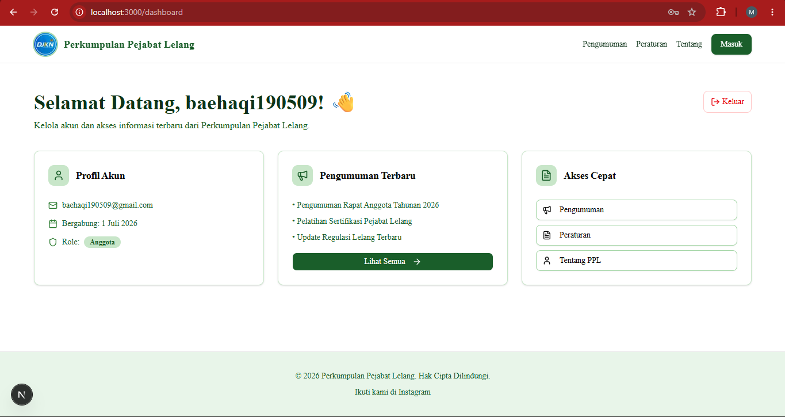
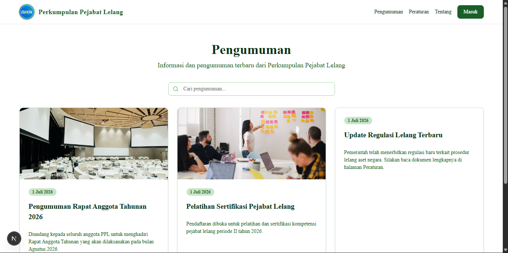
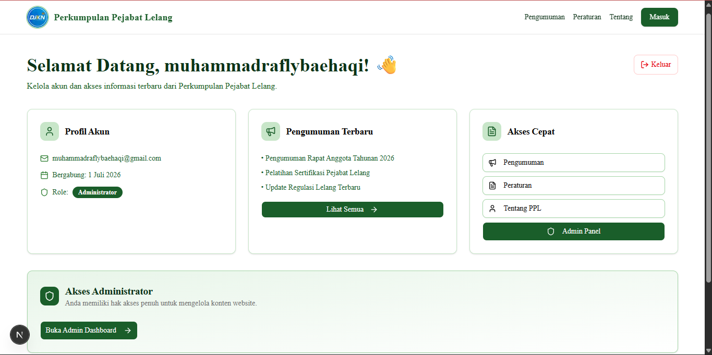

<div align="center">
  
  
  <h1>Perkumpulan Pejabat Lelang (PPL)</h1>
  
  <p>
    <strong>Website Resmi Perkumpulan Pejabat Lelang Indonesia</strong>
  </p>
  
  <p>
    Platform digital modern untuk mengelola pengumuman, peraturan, dan keanggotaan 
    Perkumpulan Pejabat Lelang dengan sistem autentikasi yang aman dan dashboard interaktif.
  </p>

  <p>
    <a href="#fitur">Fitur</a> •
    <a href="#tech-stack">Tech Stack</a> •
    <a href="#instalasi">Instalasi</a> •
    <a href="#usage">Usage</a> •
    <a href="#deployment">Deployment</a>
  </p>

  <br />

  [](https://nextjs.org/)
  [](https://www.typescriptlang.org/)
  [](https://supabase.com/)
  [](https://tailwindcss.com/)
  [](https://ui.shadcn.com/)
  [](https://vercel.com/)

  <br />

  []()
  []()

</div>

---

## 📸 Screenshots

<div align="center">
  <table>
    <tr>
      <td align="center">
        
        <br />
        <em>Landing Page - Glassmorphism Hero</em>
      </td>
      <td align="center">
        
        <br />
        <em>User Dashboard dengan Collapsible Sidebar</em>
      </td>
    </tr>
    <tr>
      <td align="center">
        
        <br />
        <em>Halaman Pengumuman dengan Search & Pagination</em>
      </td>
      <td align="center">
        
        <br />
        <em>Admin Dashboard</em>
      </td>
    </tr>
  </table>
</div>

---

## ✨ Fitur

### 🌐 Public Features
- **Landing Page Modern** - Hero section dengan desain glassmorphism light theme
- **Pengumuman & Peraturan** - Card grid dengan search dan pagination
- **Tentang Kami** - Informasi lengkap organisasi dengan Bento Grid layout
- **Responsive Design** - Optimal di semua ukuran layar (mobile-first)
- **SEO Optimized** - Metadata lengkap dan semantic HTML
- **Smooth Animations** - Framer Motion untuk entrance animations

### 🔐 Authentication & Authorization
- **Supabase Auth** - Sistem autentikasi yang aman dan scalable
- **Role-Based Access Control** - Pemisahan hak akses antara user dan admin
- **Protected Routes** - Proxy middleware-based route protection
- **Email Verification** - Verifikasi email otomatis saat registrasi
- **Secure Logout** - Server-side logout dengan session clearing

### 👤 User Dashboard
- **Collapsible Sidebar** - Menu navigasi yang bisa di-hide/show
- **Realtime Stats** - Total pengumuman, peraturan, hari bergabung (realtime)
- **Recent Activity** - Pengumuman terbaru di dashboard
- **Quick Access** - Shortcut ke fitur utama
- **Profil Akun** - Halaman profil dengan informasi lengkap
- **Pengaturan** - Placeholder untuk fitur pengaturan akun

### 🛠️ Admin Dashboard
- **Collapsible Sidebar** - Menu admin terpisah dari user
- **Overview Stats** - Total pengumuman, peraturan, anggota, views
- **Kelola Konten** - CRUD pengumuman dan peraturan
- **Form Validation** - Validasi client-side yang robust
- **Confirmation Dialog** - Mencegah accidental delete
- **Toast Notifications** - Feedback visual untuk semua operasi
- **Real-time Updates** - Data refresh tanpa reload halaman

### 🎨 UI/UX Excellence
- **Glassmorphism Hero** - Desain modern dengan backdrop blur
- **Loading States** - Skeleton loading untuk semua halaman dinamis
- **Error Boundaries** - Graceful error handling dengan retry mechanism
- **Toast Notifications** - Feedback visual untuk semua operasi
- **Confirmation Dialog** - Mencegah accidental delete
- **Professional Design** - Palet warna DJKN yang konsisten

---

## 🚀 Tech Stack

### Frontend
- **Framework:** [Next.js 16](https://nextjs.org/) (App Router)
- **Language:** [TypeScript](https://www.typescriptlang.org/) 5.0
- **Styling:** [Tailwind CSS](https://tailwindcss.com/) 4.0
- **UI Components:** [shadcn/ui](https://ui.shadcn.com/)
- **Animations:** [Framer Motion](https://www.framer.com/motion/)
- **Icons:** [Lucide React](https://lucide.dev/)

### Backend & Database
- **Database:** [Supabase](https://supabase.com/) (PostgreSQL)
- **Authentication:** Supabase Auth
- **Row Level Security:** Database-level access control
- **Storage:** Supabase Storage (untuk gambar)

### Development Tools
- **Package Manager:** npm
- **Linting:** ESLint
- **Type Checking:** TypeScript strict mode
- **Deployment:** [Vercel](https://vercel.com/)

### Email & Notifications
- **Resend** - Modern email delivery service
- **React Email** - Email template builder dengan React

### Rich Text
- **Tiptap** - Headless WYSIWYG editor
- **ProseMirror** - Underlying editor framework

### Storage
- **Supabase Storage** - File upload & image hosting

---

## 📋 Prerequisites

Sebelum memulai, pastikan Anda telah menginstall:

- **Node.js** 18.17 atau lebih tinggi ([Download](https://nodejs.org/))
- **npm** 9.0 atau lebih tinggi
- **Git** ([Download](https://git-scm.com/))
- **Akun Supabase** ([Daftar Gratis](https://supabase.com/))

---

## 🔧 Instalasi

### 1. Clone Repository

```bash
git clone https://github.com/R4fly/perkumpulan-pejabat-lelang.git
cd perkumpulan-pejabat-lelang
```

### 2. Install Dependencies

```bash
npm install
```

### 3. Setup Environment Variables

Buat file `.env.local` di root proyek:

```bash
cp .env.example .env.local
```

Isi variabel berikut:

```env
# Resend Configuration (BARU)
RESEND_API_KEY=re_xxxxxxxx
RESEND_FROM_EMAIL=noreply@your-domain.com

# Site URL (BARU - untuk email links)
NEXT_PUBLIC_SITE_URL=https://your-project.vercel.app
```

> **Cara mendapatkan Supabase credentials:**
> 1. Buat proyek baru di [Supabase Dashboard](https://supabase.com/dashboard/)
> 2. Buka **Settings** → **API**
> 3. Copy **Project URL** dan **anon/public key**

> **Cara mendapatkan Resend API Key:**
> 1. Buka [https://resend.com](https://resend.com)
> 2. Login → **API Keys** → **Create API Key**
> 3. Copy key (format: `re_xxxxxxxx`)

> **Catatan:**
> Ganti `noreply@your-domain.com` dengan domain Anda
> Untuk testing, bisa pakai `noreply@resend.dev` (Resend provide free test domain)
> `NEXT_PUBLIC_SITE_URL` harus match dengan domain Vercel Anda

### 4. Setup Database

Buka **SQL Editor** di Supabase Dashboard dan jalankan script berikut:

```sql
-- 1. Buat tabel announcements
create table announcements (
  id uuid default gen_random_uuid() primary key,
  title text not null,
  description text,
  image_url text,
  created_at timestamp with time zone default timezone('utc'::text, now()) not null
);

-- 2. Buat tabel regulations
create table regulations (
  id uuid default gen_random_uuid() primary key,
  title text not null,
  description text,
  file_url text,
  created_at timestamp with time zone default timezone('utc'::text, now()) not null
);

-- 3. Buat tabel profiles
create table public.profiles (
  id uuid references auth.users on delete cascade primary key,
  email text unique not null,
  role text default 'user' check (role in ('user', 'admin')),
  created_at timestamp with time zone default timezone('utc'::text, now()) not null,
  updated_at timestamp with time zone default timezone('utc'::text, now()) not null
);

-- 4. Aktifkan RLS
alter table announcements enable row level security;
alter table regulations enable row level security;
alter table public.profiles enable row level security;

-- 5. Buat policies untuk announcements
create policy "Public read access on announcements"
  on announcements for select using (true);

create policy "Admins can insert announcements"
  on announcements for insert
  with check (exists (select 1 from public.profiles where id = auth.uid() and role = 'admin'));

create policy "Admins can update announcements"
  on announcements for update
  using (exists (select 1 from public.profiles where id = auth.uid() and role = 'admin'));

create policy "Admins can delete announcements"
  on announcements for delete
  using (exists (select 1 from public.profiles where id = auth.uid() and role = 'admin'));

-- 6. Buat policies untuk regulations
create policy "Public read access on regulations"
  on regulations for select using (true);

create policy "Admins can insert regulations"
  on regulations for insert
  with check (exists (select 1 from public.profiles where id = auth.uid() and role = 'admin'));

create policy "Admins can update regulations"
  on regulations for update
  using (exists (select 1 from public.profiles where id = auth.uid() and role = 'admin'));

create policy "Admins can delete regulations"
  on regulations for delete
  using (exists (select 1 from public.profiles where id = auth.uid() and role = 'admin'));

-- 7. Buat policies untuk profiles
create policy "Users can view own profile"
  on public.profiles for select
  using (auth.uid() = id);

create policy "Users can update own profile"
  on public.profiles for update
  using (auth.uid() = id);

-- 8. Fungsi untuk handle user signup
create or replace function public.handle_new_user()
returns trigger as $$
begin
  insert into public.profiles (id, email, role)
  values (new.id, new.email, 'user');
  return new;
end;
$$ language plpgsql security definer;

-- 9. Trigger untuk auto-create profile
create trigger on_auth_user_created
  after insert on auth.users
  for each row execute procedure public.handle_new_user();

-- 10. Fungsi helper untuk cek admin (bypass RLS)
create or replace function public.is_admin(user_id uuid)
returns boolean 
language sql 
security definer
set search_path = public
as $$
  select exists (
    select 1 from public.profiles
    where id = user_id and role = 'admin'
  );
$$;

-- 11. Grant permission
grant execute on function public.is_admin(uuid) to authenticated;
```

### 5. Set Admin Role

Setelah mendaftar melalui website, jalankan SQL ini untuk set role admin:

```sql
UPDATE public.profiles
SET role = 'admin'
WHERE email = 'email-admin-anda@email.com';
```

### 6. Jalankan Development Server

```bash
npm run dev
```

Buka [http://localhost:3000](http://localhost:3000) di browser Anda.

---

## 📖 Usage

### Untuk User Biasa

1. **Registrasi** - Buka `/login` dan klik "Daftar di sini"
2. **Verifikasi Email** - Cek inbox dan klik link verifikasi
3. **Login** - Masuk dengan email dan password
4. **Dashboard** - Akses `/dashboard` untuk melihat info akun
5. **Browse Content** - Jelajahi pengumuman dan peraturan

### Untuk Admin

1. **Login sebagai Admin** - Gunakan akun yang sudah di-set role admin
2. **Akses Admin Panel** - Klik "Admin Panel" di dashboard
3. **Kelola Konten** - Tambah, edit, atau hapus pengumuman/peraturan
4. **Monitor** - Lihat daftar semua konten yang telah diunggah

---

### 📎 Advanced Features
- **File Upload** - Upload gambar langsung ke Supabase Storage dengan drag & drop
- **Rich Text Editor** - Editor WYSIWYG Tiptap dengan formatting lengkap (bold, italic, headings, lists, links, images)
- **Email Notifications** - Welcome email & announcement notifications via Resend
- **Subscription Management** - User bisa subscribe/unsubscribe dari notifikasi email
- **Social Sharing** - Share ke 7 platform (WhatsApp, Facebook, Twitter/X, LinkedIn, Telegram, Email, Copy Link)
- **Unsubscribe System** - Token-based unsubscribe dengan halaman konfirmasi

---

## 🏗️ Project Structure

```
perkumpulan-pejabat-lelang/
├── app/
│   ├── admin/              # Admin dashboard dengan sidebar
│   ├── api/                # API routes
│   ├── dashboard/          # User dashboard dengan sidebar
│   │   ├── profil/         # Halaman profil user
│   │   └── pengaturan/     # Halaman pengaturan user
│   ├── login/              # Login/Register page
│   ├── pengumuman/         # Announcements page dengan search & pagination
│   ├── peraturan/          # Regulations page dengan search & pagination
│   ├── tentang/            # About page dengan bento grid
│   ├── layout.tsx          # Root layout
│   ├── page.tsx            # Landing page dengan glassmorphism hero
│   └── globals.css         # Global styles
├── components/
│   ├── layout/             # Layout components (Navbar, Footer, Sidebar)
│   ├── landing/            # Landing page sections
│   ├── dashboard/          # Dashboard components (StatsCard, JoinDuration)
│   └── ui/                 # shadcn/ui components
├── lib/
│   ├── services/           # Data fetching services
│   ├── supabase/           # Supabase client utilities
│   ├── auth.ts             # Auth utilities
│   ├── validation.ts       # Form validation
│   └── utils.ts            # Helper functions
├── public/                 # Static assets (djkn.jpeg, background.jpeg)
├── proxy.ts                # Proxy middleware for route protection
├── next.config.ts          # Next.js configuration
├── tailwind.config.ts      # Tailwind configuration
└── package.json            # Dependencies
```

---

## 🌐 Deployment

### Deploy ke Vercel (Recommended)

Cara termudah untuk deploy adalah menggunakan [Vercel Platform](https://vercel.com):

1. **Push ke Github**
```bash
git add .
git commit -m "Initial commit"
git push origin main
```

2. **Import di Vercel**
- Buka [Vercel Dashboard](https://vercel.com)
- Klik **"New Project"**
- Import repository GitHub Anda
- Vercel akan otomatis detect Next.js

3. **Configure Environment Variables**
Di Vercel Dashboard → Settings → Environment Variables, tambahkan:
```env
NEXT_PUBLIC_SUPABASE_URL=https://your-project-id.supabase.co
NEXT_PUBLIC_SUPABASE_ANON_KEY=your-anon-key
ADMIN_EMAIL=admin@ppl-indonesia.org
```

4. **Deploy**
- Klik **"Deploy"**
- Tunggu proses deployment selesai
- Website Anda akan live di `https://your-project.vercel.app`

5. **Alternative: Deploy Manual**
```bash
npm run build
npm run start
```

---

## 🧪 Testing

### Manual Testing Checklist

- [ ] Landing page loads correctly dengan glassmorphism hero
- [ ] Navigation links work
- [ ] User registration flow
- [ ] Email verification
- [ ] User login/logout
- [ ] Dashboard access dengan collapsible sidebar
- [ ] Admin panel access
- [ ] Create announcement
- [ ] Delete announcement dengan confirmation
- [ ] Search functionality
- [ ] Pagination
- [ ] Responsive design (mobile/tablet/desktop)
- [ ] Realtime join duration di dashboard
- [ ] Sidebar tidak tembus navbar

---

## 🤝 Contributing

Contributions, issues, dan feature requests sangat diterima!

1. Fork repository ini
2. Buat branch fitur baru (`git checkout -b feature/AmazingFeature`)
3. Commit perubahan (`git commit -m 'Add some AmazingFeature'`)
4. Push ke branch (`git push origin feature/AmazingFeature`)
5. Buka Pull Request

---

## 📝 License

Proyek ini dibuat untuk **Perkumpulan Pejabat Lelang (PPL)** dan bersifat proprietary.

---

## 🙏 Acknowledgments

- [Next.js](https://nextjs.org) - Framework React terbaik
- [Supabase](https://supabase.com) - Backend-as-a-Service open source
- [shadcn/ui](https://ui.shadcn.com) - Komponen UI yang beautiful
- [Tailwind CSS](https://tailwindcss.com) - Utility-first CSS framework
- [Framer Motion](https://www.framer.com/motion) - Library animasi untuk React
- [Lucide](https://lucide.dev) - Icon set yang modern
- [Vercel](https://vercel.com) - Platform deployment terbaik

---

## 📞 Contact

- **Perkumpulan Pejabat Lelang (PPL)**
- Instagram: [@pejabatlelang.id](https://www.instagram.com/pejabatlelang.id/)
- Website: [www.ppl-indonesia.org](https://www.ppl-indonesia.org)

---

## 📊 Project Status

✅ **Version 1.0.0** - Production Ready

- ✅ Authentication & Authorization dengan RBAC
- ✅ User Dashboard dengan Collapsible Sidebar
- ✅ Admin Dashboard dengan Collapsible Sidebar
- ✅ CRUD Operations untuk Pengumuman & Peraturan
- ✅ Search & Pagination
- ✅ Glassmorphism Hero Section
- ✅ Realtime Join Duration
- ✅ Responsive Design
- ✅ SEO Optimized
- ✅ Ready to Deploy to Vercel

---

<div align="center">
  <p>
    Dibuat dengan ❤️ oleh <strong>Muhammad Rafly Baehaqi</strong>
  </p>
  <p>
    <a href="https://www.npmjs.com/~baehaqirafly3" target="_blank" rel="noopener noreferrer">
      
    </a>
    <a href="https://github.com/R4fly" target="_blank" rel="noopener noreferrer">
      
    </a>
  </p>
  <p>
    <sub>© 2026 Perkumpulan Pejabat Lelang. All rights reserved.</sub>
  </p>
</div>